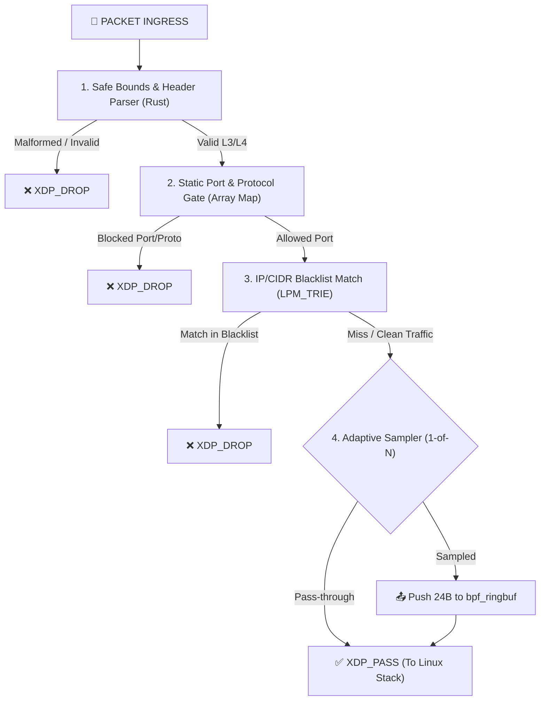

# 🏛️ Core Packet Processing Pipeline Architecture

The core architecture of **AI-IDA** is designed around the **Fail-Fast** principle and enforces a strict separation between the fast data path (in-kernel XDP) and the control plane (user-space daemon).

---

## 1. Kernel Packet Processing Flow (XDP Ingress)

---

## 2. Kernel eBPF Maps Specification

### `static_port_gate`
- **Type:** `BPF_MAP_TYPE_ARRAY`
- **Capacity:** 65,536 entries (Index = L4 Port Number)
- **Performance:** $O(1)$ lookup with sub-microsecond/single-digit nanosecond latency.

### `reputation_trie`
- **Type:** `BPF_MAP_TYPE_LPM_TRIE`
- **Key Structure:** `{ u32 prefix_len, u32 ipv4_addr }`
- **Performance:** Longest Prefix Match (LPM) for blocking individual IPv4 addresses and CIDR subnets.

### `telemetry_ringbuf`
- **Type:** `BPF_MAP_TYPE_RINGBUF`
- **Capacity:** Multi-megabyte buffer (configured based on available system RAM)
- **Performance:** High-throughput, lockless zero-copy ring buffer for streaming packet metadata to user space.

---

## 3. Related Links & References
- **Module Specifications:** [[MOD-01-Safe-Parser]] | [[MOD-02-Static-ACL]]
- **Binary Contract:** [[Memory-Layout-24B]]
- **Architecture Decision Records:** [[ADR-0001-Pipeline-Order]]
