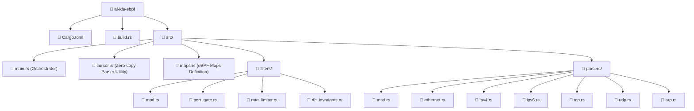

# 🛡️ Comprehensive eBPF / XDP Subsystem Documentation (`ai-ida-ebpf`)

This technical reference document details the architectural structure, file hierarchy, and module specifications for all components within the `ai-ida-ebpf` crate, formatted to Obsidian Markdown standards.

---

## 🗂️ File Inventory & Module Hierarchy



---

## 1. Configuration & Build Scripts

### 📄 `Cargo.toml`
* **Path:** `ai-ida-ebpf/Cargo.toml`
* **Purpose:** Defines the eBPF package manifest, compilation targets, and dependency graph.
* **Key Dependencies:**
  * `aya-ebpf`: The core kernel-space Rust framework for XDP program development.
  * `aya-log-ebpf`: Kernel-space structured logging utilities.
  * `ai-ida-common`: Shared data structures (`FlowPacketMeta`, protocol constants) shared between kernel space and user space.
* **Compilation Note:** Compiles as a freestanding binary targeting the `bpfel-unknown-none` target architecture.

---

### 📄 `build.rs`
* **Path:** `ai-ida-ebpf/build.rs`
* **Purpose:** Manages the build lifecycle and tracks changes to the eBPF linker.
* **Functionality:**
  * Verifies the presence and accessibility of the `bpf-linker` binary in the system `PATH`.
  * Emits `cargo:rerun-if-changed` instructions to invalidate build caches whenever `bpf-linker` updates or moves, ensuring reproducible builds.

---

## 2. Core Runtime & Foundations (`src/`)

### 📄 `src/main.rs`
* **Path:** `ai-ida-ebpf/src/main.rs`
* **Program Type:** `#[xdp]` Program (`ai_ida_firewall` entrypoint function)
* **Purpose:** Serves as the primary ingress orchestrator attached to the network interface driver layer.
* **Packet Processing Execution Pipeline:**
  1. **Cursor Initialization (`Cursor`):** Retrieves the `data` and `data_end` pointer boundaries from `XdpContext`.
  2. **Layer 2 Parsing (`parse_ethernet`):** Extracts MAC addresses and EtherType while transparently bypassing VLAN/QinQ tags.
  3. **Layer 3 Inspection:**
     - **IPv4:** Parses the IP header and checks fragmentation; non-initial fragments are rate-limited.
     - **ARP:** Validates fields to mitigate ARP poisoning and spoofing attacks.
  4. **Layer 4 Parsing:** Extracts source and destination ports along with TCP/UDP control flags.
  5. **RFC Compliance Validation (`validate_rfc_invariants`):** Instantly drops anomalous packets (e.g., Land attacks, NULL scans, Xmas scans, and invalid SYN+FIN combinations).
  6. **Reputation Blocklist Check (`REPUTATION_MAP`):** Matches source IP prefixes against the `LPM_TRIE`. On match, immediately executes `XDP_DROP`.
  7. **Static Port Gate (`is_port_blocked`):** Evaluates destination ports in $O(1)$ time to block restricted services.
  8. **Lockless Rate Limiting (`check_rate_limit`):** Mitigates packet floods using a Token Bucket algorithm backed by `LRU_PERCPU_HASH` storage.
  9. **Zero-Copy Telemetry Streaming (`EVENTS.output`):** Emits 24-byte `FlowPacketMeta` descriptors to the lockless `RingBuf` for user-space AI analysis.
  10. **Final Verdict:** Passes verified clean traffic to the host network stack via `XDP_PASS`.

---

### 📄 `src/cursor.rs`
* **Path:** `ai-ida-ebpf/src/cursor.rs`
* **Purpose:** Provides a zero-cost abstraction for safe, bounds-checked memory traversal in eBPF.
* **Data Structure:**
  ```rust
  pub struct Cursor {
      start: usize,
      end: usize,
      offset: usize,
  }
  ```
* **Key Methods:**
  * `new(ctx: &XdpContext)`: Initializes the cursor with packet memory boundaries.
  * `read<T>() -> Result<*const T, ()>`: Proves the condition `start + offset + sizeof(T) <= end` to satisfy the **eBPF Verifier** and returns a typed pointer to `T`.
  * `advance(bytes: usize) -> Result<(), ()>`: Safely steps past variable-length fields (such as IPv4 options, TCP options, or IPv6 extension headers).
  * `current_offset()`: Returns the total number of bytes traversed from the packet start.

---

### 📄 `src/maps.rs`
* **Path:** `ai-ida-ebpf/src/maps.rs`
* **Purpose:** Declares kernel eBPF maps for synchronization between the fast data path and the Go control plane.
* **Map Definitions:**
  1. `REPUTATION_MAP: LpmTrie<u32, u32>`:
     - Longest Prefix Match trie with a capacity of 16,384 entries for high-speed IP and CIDR prefix blocking.
  2. `PORT_GATE_MAP: Array<u8>`:
     - 65,536-element array indexing L4 port states (`1` = Allowed, `2` = Blocked).
  3. `RATE_LIMIT_MAP: LruPerCpuHashMap<u32, RateLimitState>`:
     - 65,536-entry LRU cache maintaining token bucket state per source IP on a per-CPU basis (lockless).
  4. `EVENTS: RingBuf`:
     - 1 MB lockless zero-copy ring buffer for streaming 24-byte telemetry records to user-space collectors.

---

## 3. Filtering & Security Modules (`src/filters/`)

### 📄 `src/filters/mod.rs`
* **Path:** `ai-ida-ebpf/src/filters/mod.rs`
* **Purpose:** Re-exports filtering submodules (`port_gate`, `rate_limiter`, `rfc_invariants`).

---

### 📄 `src/filters/port_gate.rs`
* **Path:** `ai-ida-ebpf/src/filters/port_gate.rs`
* **Purpose:** Enforces $O(1)$ static port filtering.
* **Key Functions:**
  * `is_port_blocked(dst_port: u16) -> bool`: Looks up the destination port in `PORT_GATE_MAP`; drops the packet immediately if the value equals `2`.

---

### 📄 `src/filters/rate_limiter.rs`
* **Path:** `ai-ida-ebpf/src/filters/rate_limiter.rs`
* **Purpose:** Prevents volumetric DoS/DDoS attacks via an in-kernel **Token Bucket** algorithm.
* **Configuration & Computational Logic:**
  * `NANOS_PER_TOKEN = 100_000` ns (Replenishment rate: 10,000 packets per second).
  * `BURST_CAPACITY = 20_000` packets (Maximum allowable burst allowance).
  * Calculates new token allocations using 64-bit saturating arithmetic (`saturating_sub`) to avoid arithmetic overflows and heavy compiler helper dependencies.
  * Drops the packet when insufficient tokens remain in the bucket.

---

### 📄 `src/filters/rfc_invariants.rs`
* **Path:** `ai-ida-ebpf/src/filters/rfc_invariants.rs`
* **Purpose:** Identifies malformed and non-compliant network packets in single-digit nanoseconds:
  1. **Land Attack:** Packets where `src_ip == dst_ip`.
  2. **NULL Scan:** TCP packets with all flags cleared (`tcp_flags == 0`).
  3. **SYN + FIN Attack:** Contradictory connection open/close flags asserted simultaneously.
  4. **Xmas Tree Scan:** Simultaneous assertion of `FIN | PSH | URG` flags.

---

## 4. Protocol Parser Modules (`src/parsers/`)

### 📄 `src/parsers/mod.rs`
* **Path:** `ai-ida-ebpf/src/parsers/mod.rs`
* **Purpose:** Defines the lightweight parsed packet intermediate representation and exports protocol parsers.
* **`ParsedPacket` Structure:**
  ```rust
  pub struct ParsedPacket {
      pub src_ip: u32,
      pub dst_ip: u32,
      pub src_port: u16,
      pub dst_port: u16,
      pub protocol: u8,
      pub tcp_flags: u8,
      pub length: u16,
      pub is_fragment: bool,
  }
  ```

---

### 📄 `src/parsers/ethernet.rs`
* **Path:** `ai-ida-ebpf/src/parsers/ethernet.rs`
* **Purpose:** Extracts Layer 2 Ethernet headers (MAC addresses and EtherType).
* **Features:** Implements bounded iteration (max 2 steps) to safely unwrap 802.1Q (VLAN) and 802.1ad (QinQ) tags to access the encapsulated Layer 3 payload.

---

### 📄 `src/parsers/ipv4.rs`
* **Path:** `ai-ida-ebpf/src/parsers/ipv4.rs`
* **Purpose:** Parses standard IPv4 headers and validates Version and Internet Header Length (IHL) fields.
* **Features:**
  * Identifies packet fragmentation by checking the More Fragments (MF) flag or non-zero Fragment Offset values.
  * Safely advances the cursor over optional IP header options when `ihl > 5`.

---

### 📄 `src/parsers/ipv6.rs`
* **Path:** `ai-ida-ebpf/src/parsers/ipv6.rs`
* **Purpose:** Parses Layer 3 IPv6 headers.
* **Features:** Supports extension header chains (Hop-by-Hop, Routing, Destination Options, Fragment) with up to 4 bounded traversal steps.

---

### 📄 `src/parsers/tcp.rs`
* **Path:** `ai-ida-ebpf/src/parsers/tcp.rs`
* **Purpose:** Extracts source/destination ports, TCP flags (SYN, ACK, FIN, RST, etc.), and computes the data offset.
* **Features:** Safely advances the cursor past TCP options to provide direct access to the transport payload.

---

### 📄 `src/parsers/udp.rs`
* **Path:** `ai-ida-ebpf/src/parsers/udp.rs`
* **Purpose:** Extracts UDP source and destination ports while validating the minimum required 8-byte UDP header length.

---

### 📄 `src/parsers/arp.rs`
* **Path:** `ai-ida-ebpf/src/parsers/arp.rs`
* **Purpose:** Validates ARP headers by verifying hardware type (`htype == 1` for Ethernet), protocol type (`ptype == 0x0800` for IPv4), and hardware/protocol address lengths (`hlen == 6`, `plen == 4`).
